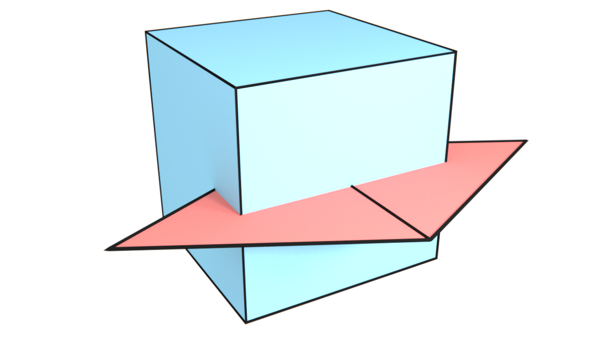
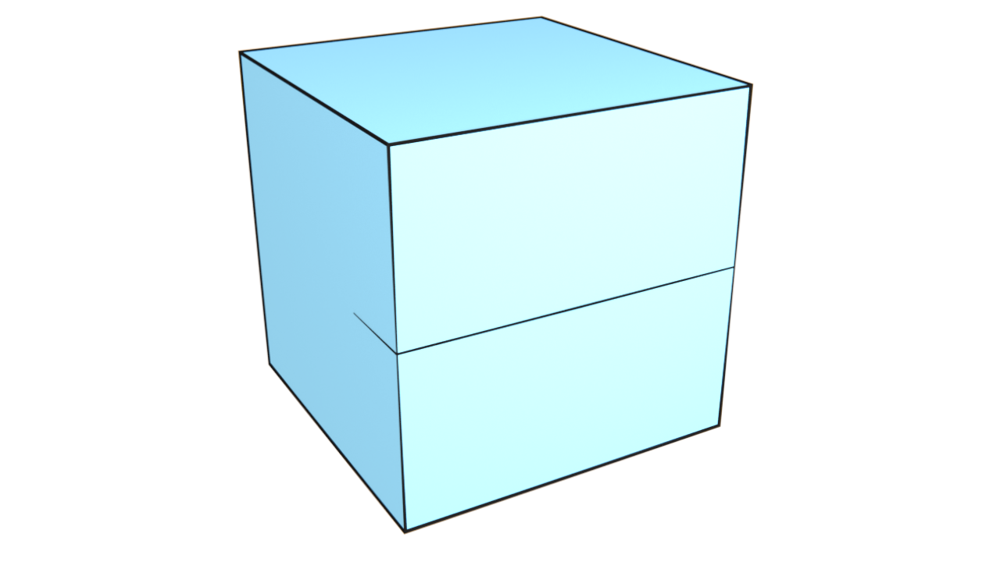
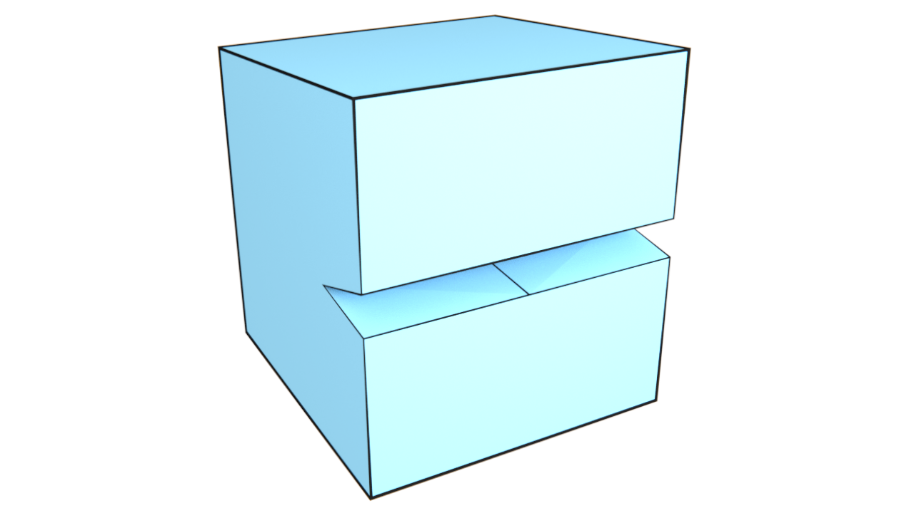

# Compilation

MCUT is hosted on [Github](https://github.com/cutdigital/mcut.git). 

*System requirements*

* CMake. 
* C++11 compiler support. 

*Setup*

```sh
git clone https://github.com/cutdigital/mcut.git
cd mcut/ 
mkdir build 
cd build 
cmake .. 
```

Refer to the `mcut/CMakeLists.txt` for information about extra configuration flags.

---

<div class="row">
  <div class="column">
     
  </div>
  <div class="column">
    
  </div>
  <div class="column">
     
  </div>
</div>