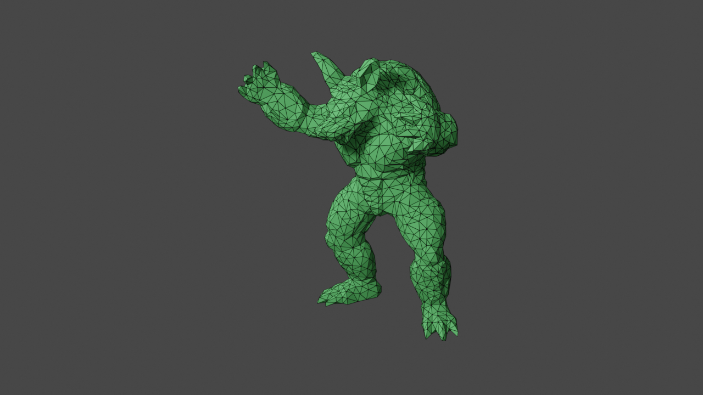
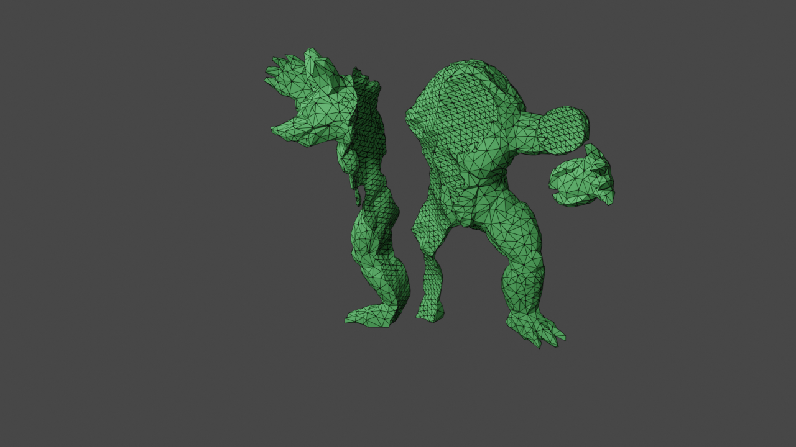
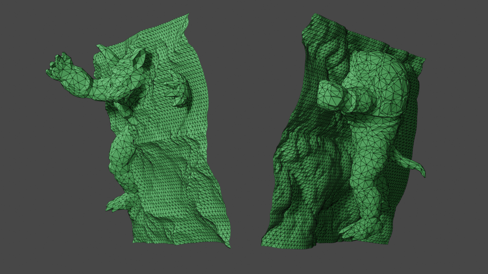
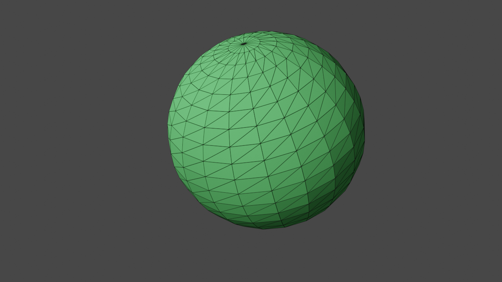
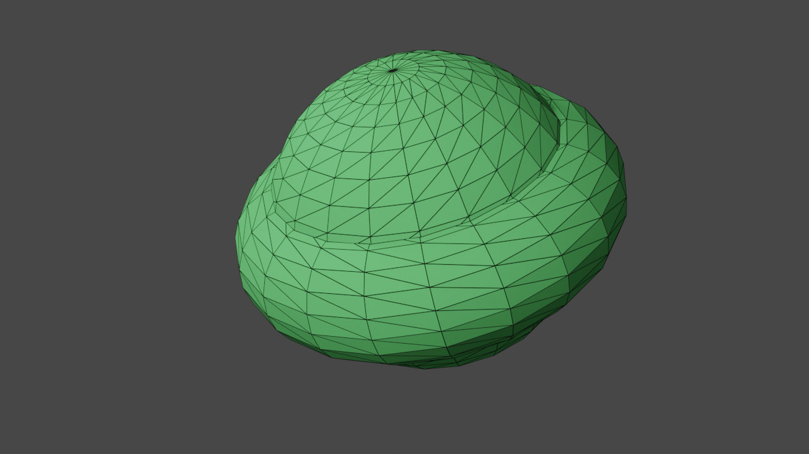
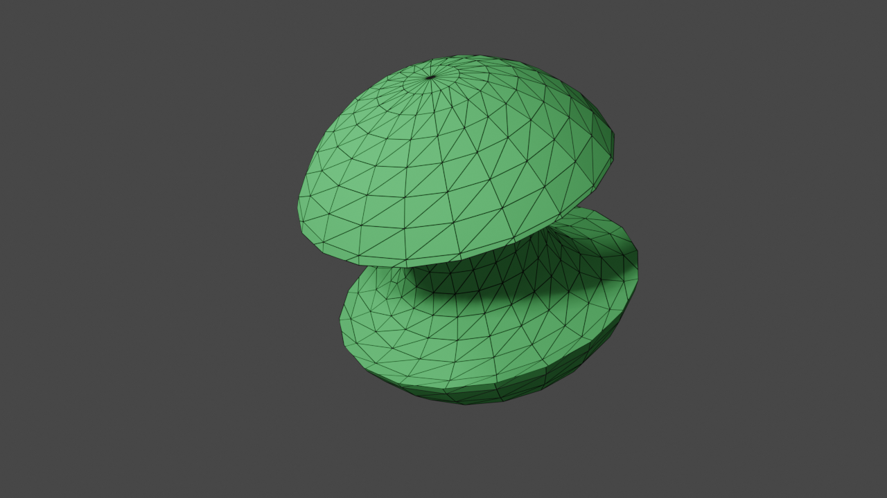
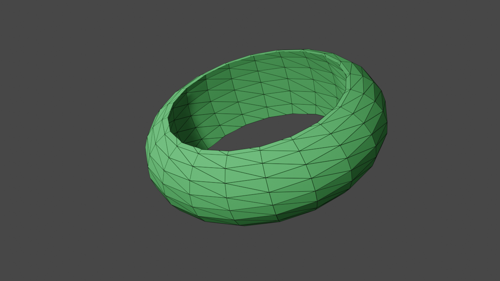
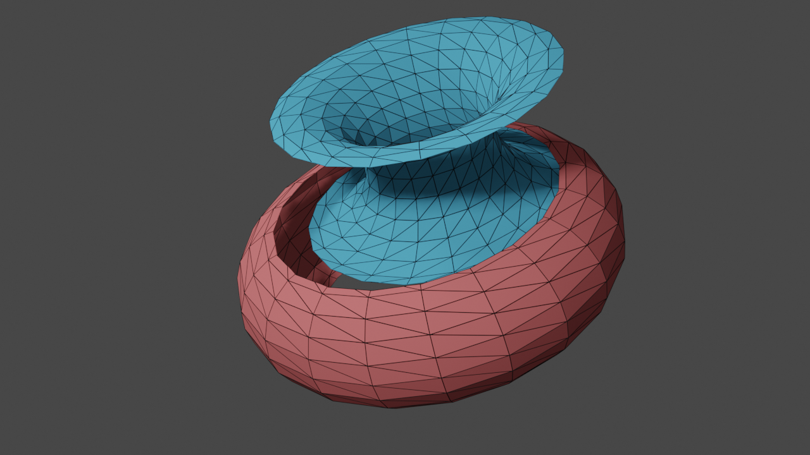

# Gallery

This page shows some examples of cutting meshes using MCUT.

## Armadillo cut

An armadillo is cut by a terrain-like surface.

### Input

The input meshes. 

    

	   
       
Source mesh (Armadillo)

    

    

	    
        
Cut mesh (Terrain)

    

### Output 

The results of the cut.

    

	   
       
Unsealed source mesh fragments

    

    

	    
        
Cut mesh patches

    

    

	   
       
Sealed (interior) source mesh fragments

    

    

	    
        
Sealed (exterior) source mesh fragments

    

## Sphere torus CSG

Cutting a sphere with a torus (both watertight).

### Input

The input meshes. 

    

	   
       
Source mesh (Sphere)

    

    

	    
        
Cut mesh (Torus)

    

### Output

The results of the cut.

    

	   
       
Intersection

    

    

	    
        
Union

    

    

	   
       
Subtract torus 

    

    

	    
        
Subtract sphere

    

    

	   
       
Patches 

    

    

	    
        
Sphere fragments (unsealed)

    

