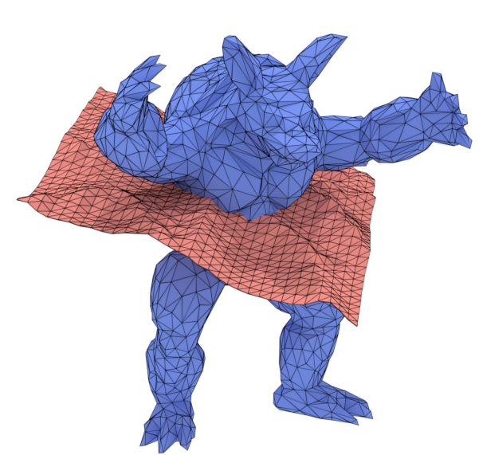
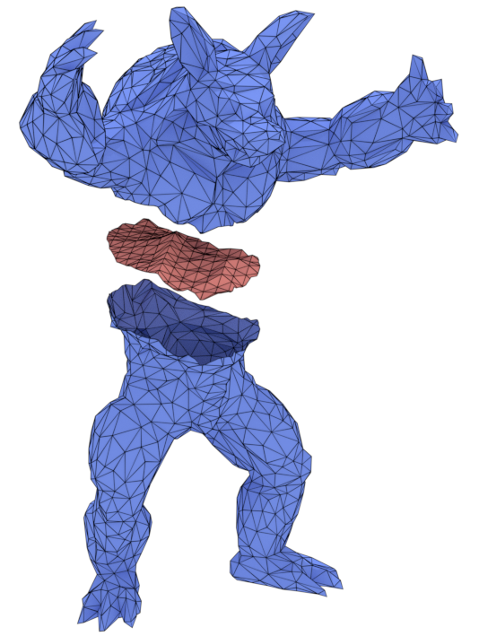
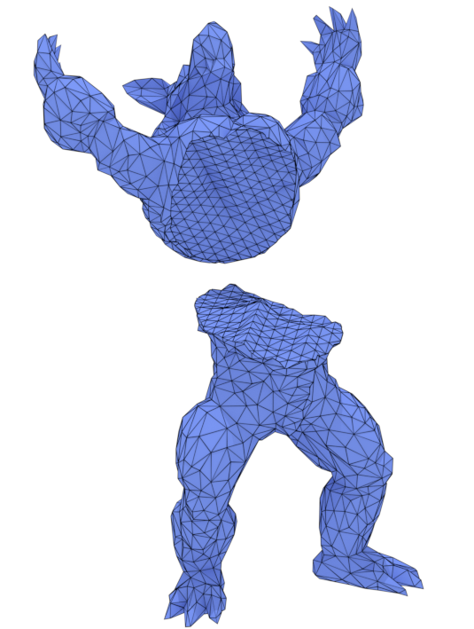
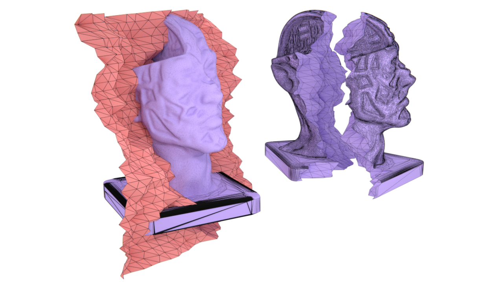

# Welcome to MCUT 

    

	   
    

    

	     
    

## Overview

**MCUT** (pronounced 'emcut') is a tool for cutting meshes. It is a library for partitioning 2-manifold polygon meshes in order to perform operations like _slicing_, _stenciling_, _boolean operations_ and more using a single interface. 

MCUT partitions shapes as meshes directly from input data composed of geometry and connectivity to produce crisp fragments at fine scale. There are no precomputed discretizations like tetrahedral decompositions or signed distance fields (voxel level sets). MCUT uses a [breakthrough procedure](https://onlinelibrary.wiley.com/doi/abs/10.1111/cgf.13953) that we invented to achieve robustness with reliability, and it is the only existing method that properly cuts arbitrary-planar polygon meshes with no requirement for triangulation on meshes.

MCUT also provides stencilling services that calculate the exact cut-outs of the cutting surface which is used to partition a shape. In addition to basic slicing and hole filling, it can perform intersection-path queries, constructive solid geometry (CSG) operations, partial cuts and surface-to-surface cuts.

## Why mesh cutting?

In this section, we briefly describe about the utility of mesh cutting across various applications. 

Cutting is a fundamental computational geometry problem (AKA "mesh arrangements") whose solution is useful in a wide set of application domains. The goal of cutting is to partition a given surface mesh, described by its vertices and connectivity, into a set of disjoint parts.
These resulting parts are typically employed for further model design and/or simulation, such as virtual surgery, computer aided design, and fracture.

Despite existing tools (e.g. [CGAL](https://www.cgal.org/), [Cork](https://github.com/gilbo/cork), [Carve](https://code.google.com/archive/p/carve/), or [tetrahedral-mesh tools](https://github.com/loopstring/3d-cutter.git)), it is still a challenge to cut arbitary manifold surfaces without restrictive assumptions on the input meshes. Moreover, aside from traditional CSG operations, practically all sophisticated computer animation modelling software (Maya, Cinema4D, Blender etc.) permit only planar cuts which severely restricts their modelling and design capabilities in this regard.

## What MCUT can do

  

     
    
  

  

    
  

  

     
    
  

The general design of MCUT is fairly simple to describe but has essential criteria which must be satisfied for practical use. In addition to being reasonably simple and robust, MCUT is specifically designed to be _a cutting tool_, and supports the following features: 

* Arbitrary manifold meshes (open or closed) 
* Partial cut intersections 
* Stencilling (silhouette cut-outs)
* Intersection path queries
* Boolean operations (CSG)
* Arbitrary planar-polygonal subdivisions. 

The remainder of this section provides some examples of what MCUT can do.

### A simple example 

The above image shows a simple example of what MCUT can do. On the left is a cube (the "source mesh") that is cut by a circular surface (the "cut mesh"), which together comprise the _input_. On the right is the resulting set of connected components after partitioning the cube. In general, the _output_ of MCUT includes unsealed fragments (mid-left), cut mesh patches (middle), and the sealed fragments (partially or completely) whose holes have been filled with cut mesh polygons that lie on the interior of the source mesh. Sealing can also be done using cut mesh polygons that lie on the exterior of the source mesh. 

### Arbitrary planar-polygon meshes 

MCUT is a general tool in that it is particularly suited for incremental cuts by supporting N-gons. Input meshes can have arbitrary planar-polygons (convex or concave), thus avoiding strict restrictions of triangulations which are not unique with subsequent cuts. 

     
    
An extreme example, which is a result of cutting a source mesh that has concave polygons. The source mesh was a pentagonal frustum with the pentagons (top and bottom faces) made concave (and not parallel to each other). Each pentagon was composed of polygons with several concavities. The whole model was composed of only one volume element (all edges are on the surface). MCUT produces the correct fragments, and does not modify the connectivity except where intersected with the cut mesh. 

Most existing tools are underpinned by the assumption that the meshes considered are _always_ triangulated. Such an assumption can cause to severe degradation of meshes when applying subsequent cuts. Moreover, triangulation is not unique and may thus be found to be suboptimal with the introduction of incremental cuts. In effect, one would be practically forced to undo previous triangulations in order to avoid degeneracies due to newly introduced cuts, thus hindering the incremental nature of a robust cutting algorithm. 

If using MCUT in a simulation or visualisation task, one must of-course triangulate for rendering, collision detection etc. but the resulting potentially degenerate triangles are not used in further cutting. The connectivity of the resulting fragments when using MCUT is identical to the (uncut) source mesh except at edges introduced by the cut. 

Finally, the cut mesh need not partition the source mesh completely to allow _partial cut intersections_ - a feature which further lessens constraints on the relative placement of the inputs.

  

     
    
Input

  

  

    
    
Result

  

  

     
    
Stretched

  

### Robustness

MCUT is _robust_, relying on well-tested geometric predicates for resolving intersections. By default, numerical operations are computed exactly up to machine precision (`long double`). The tool can also be configured to work with arbitrary-precision if so desired, surpassing limitations of machine precision for increased reliability and peace of mind. 

   
  
Jagged surface cut. 

### Demo 

A restricted demo of the MCUT library for Linux (Ubuntu) and Windows is available here:

[Download MCUT Demo](https://github.com/cutdigital/cutdigital.github.io/blob/master/docs/media/mcut-demo.zip) 
(_Updated 20 September 2020_)

The demo contains two meshes, a tetrahedron and a quad with two triangles which are _basic_ examples highlighting the features of MCUT. The executable takes two arguments - the source mesh and the cut mesh. Here is an example:

* `./mcut_cmd ./sourcemesh.off ./cutmesh.off` 
* `./mcut_cmd ./cutmesh.off ./sourcemesh.off` (swapping inputs)

The output of this demo are `*.off` files which you can view using your favourite mesh visualization tool like [MeshLab](https://www.meshlab.net/), [Geomview](http://www.geomview.org/) (Linux only), [Blender](https://www.blender.org/) or any other tool which can open `.off` files. 

You can also test the demo with your own meshes (restricted to 16 vertices per mesh, max).

### Other examples

Refer to the [gallery](gallery) for more examples.

---