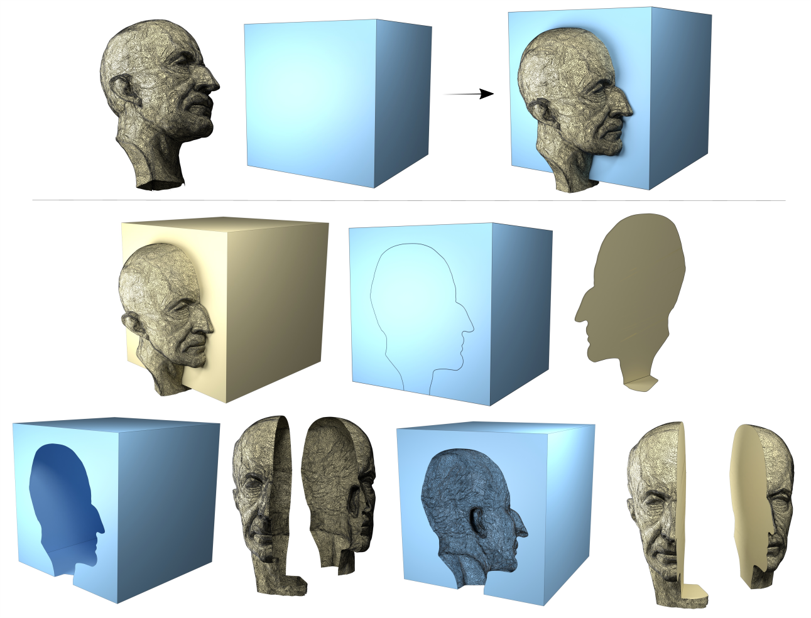

# Home

    

	   
    

**MCUT** (pronounced 'emcut') is a tool for cutting meshes: It is a library for partitioning meshes that are two-manifold and is useful for operations like regular slicing and CSG boolean operations. 

The library partitions shapes directly using their geometry to produce crisp fragments at fine scale. It is the only existing tool for cutting planar-polygon meshes without necessarily requiring them to be triangulated solids.  

MCUT also provides features like stencilling to produce cut-outs/patches of the cutting surface that is used to partition a given shape. It also supports intersection-curve queries and partial cuts.

## Motivation

Mesh cutting is fundamental and useful for solving a wide set of problems. The goal is to split a given surface mesh into a set of disjoint parts using another surface mesh.
These resulting parts are typically employed in model design and/or simulation, such as virtual surgery, game level-design, computer aided design and manufacturing.

Despite existing tools (e.g. [CGAL](https://www.cgal.org/), [Cork](https://github.com/gilbo/cork), [Carve](https://code.google.com/archive/p/carve/), [PWN](http://www.cs.columbia.edu/cg/mesh-arrangements/#definitions) or [TetMesh tools](https://github.com/loopstring/3d-cutter.git)), it remains a challenge to slice meshes without restrictive assumptions on the input. Moreover, besides traditional CSG operations, practically all sophisticated modelling software (like [Maya](https://www.autodesk.com/products/maya/overview), [Cinema4D](https://www.maxon.net/en/cinema-4d), [Blender](https://www.blender.org/), [MeshMixer](https://www.meshmixer.com/), [ANSYS SpaceClaim](https://www.ansys.com/products/3d-design/ansys-spaceclaim) etc.) allow users only to cut meshes with a plane which restricts modelling and design capabilities.

## Features

In addition to being simple, fast and robust, MCUT is specifically designed to be _a cutting tool_ which supports the following features: 

* **Manifold meshes**: _open_  (with borders/boundaries), or _closed_ (as in 'watertight'). 
* **Partial cuts**: A sliced object need not be completely cut into disjoint parts. 
* **Stencilling**: Silhouette cut-outs of the cutting surface patches.
* **Intersection curves**: Query vertices introduced as a result of a cut.
* **Booleans**: Traditional CSG operations. 
* **N-gons**: Arbitrary planar-polygon meshes. 

     
    
An extreme example, which is a result of cutting a source mesh that has concave polygons. The source mesh was a pentagonal frustum with the pentagons (top and bottom faces) made concave (and not parallel to each other). Each pentagon was composed of polygons with several concavities. The whole model was composed of only one volume element (all edges are on the surface). MCUT produces the correct fragments, and does not modify the connectivity except where intersected with the cut mesh. 

----

The gist of how MCUT works is presented in a Journal article [here](https://onlinelibrary.wiley.com/doi/abs/10.1111/cgf.13953).