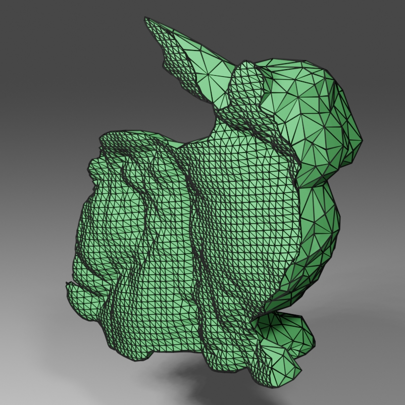
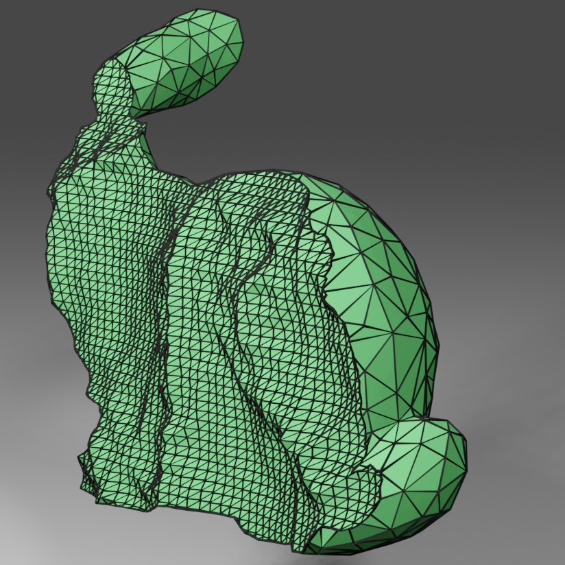

# Licensing

MCUT is available under an _Open Source license_ as well as a _commercial license_. Users choosing to use MCUT under the free-of-charge Open Source license have to comply to its terms, otherwise they have to buy a commercial license.

The Open Source license is the [GNU General Public License](https://www.gnu.org/licenses/gpl-3.0.en.html) (GPL).

Below is a brief overview of the license scheme and the rights given to users.

## Open source license

The code is released under the GPL in order to protect its commercial value. This allows for commercialisation, which guarantees long term support, maintenance and further developments of the code for the benefit of the project and its users.

**GPL primer**

[GPL](https://www.gnu.org/licenses/gpl-3.0.en.html) (v3+) is an Open Source license that, gives you the right to use, copy and modify the code freely. 

If you distribute your software based on GPL (i.e. without purchasing the commercial license), then the following applies

* You are obliged to distribute the modifications of MCUT you made, and 
* You are furthermore obliged to distribute the source code of your own software under the GPL.

## Commercial license

In cases where the constraints of the Open source license prevent you from using MCUT, you can buy a commercial license. The commercial license includes the full source code for MCUT and any associated tools, ongoing technical support, and all future updates at no additional cost. The commercial license also allows MCUT to be used in an unlimited number of products developed by a company. 

Email the [author](floyd.m.chitalu@gmail.com) for further information.

    

	   
    

    

	     
    

--- 

### Philosophy

The licensing model of MCUT is motivated by the desire to eliminate the access costs for users/creators of derivative works by minimising the restrictions posed by strict copyright rules. 

"Access costs" refers to expenses for users that wish to e.g. do research or create a derivative works—such as their own 3D mesh processing tool(s), a copy of MCUT modified to fix a bug, or add a feature—but are unable (or perhaps even unwilling) to pay for the right to do so.

This reduction of access costs also aims to increase usage by gaining "market share", leading to even more frequent creation of derivative works. The by-product of this increased usage is further awareness e.g. through recommendations via networks, forums, word-of-mouth etc. The openness of MCUT´s development and its diverse user-base will also garner additional trust as a reliable tool that is also viable for commercial use.

Being open also creates enormous value. For example, in the context of scientific research, MCUT´s functionality is shared for free and anyone with access to the source code can generate data (e.g. meshes, performance stats etc), develop simulations, and prototype geometry processing ideas amongst others. The original project may also receive feedback and potential improvements on the original design from the user community.

