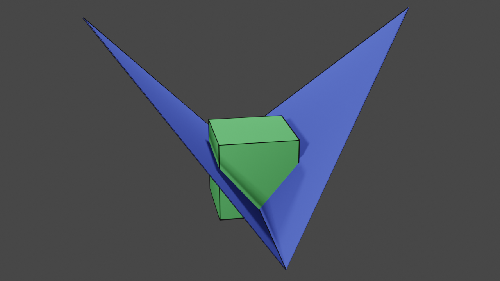
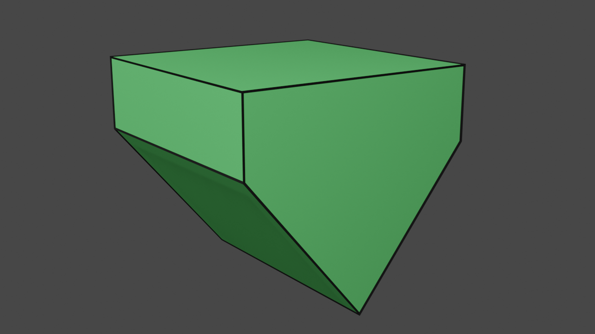
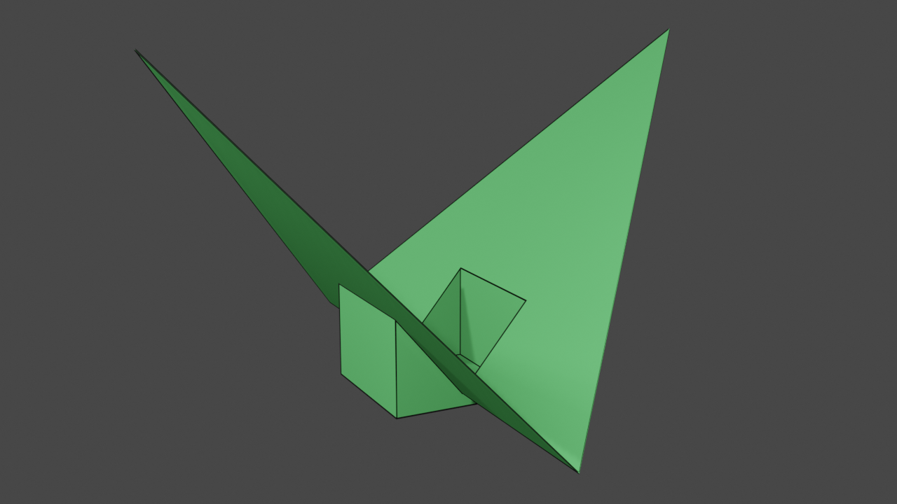
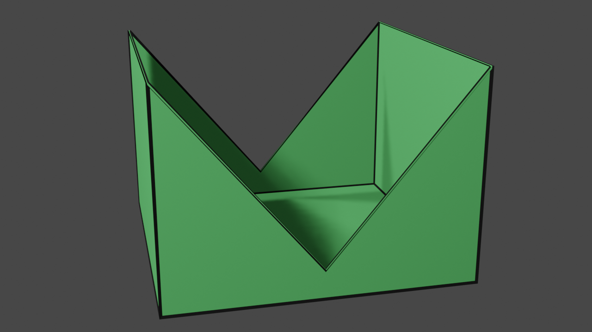
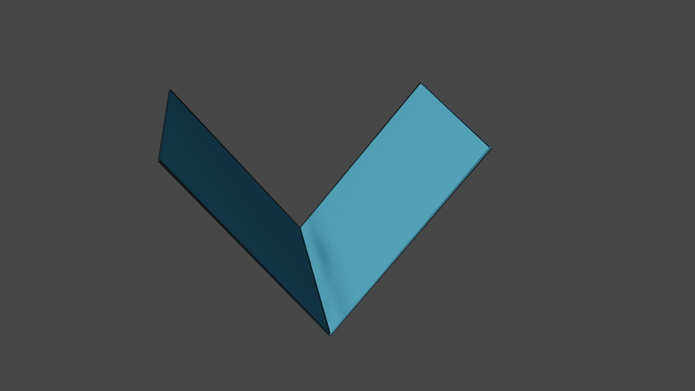
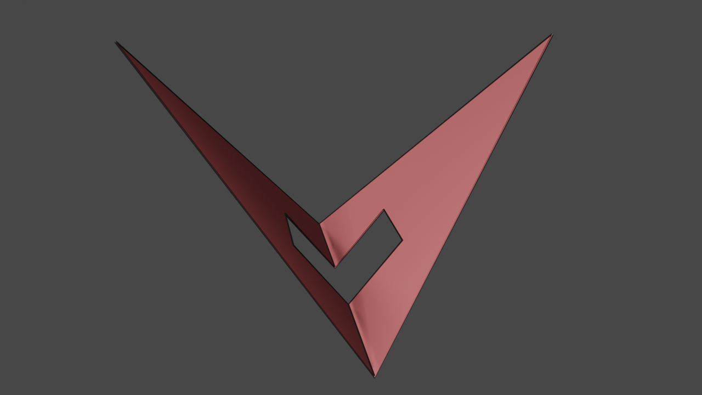
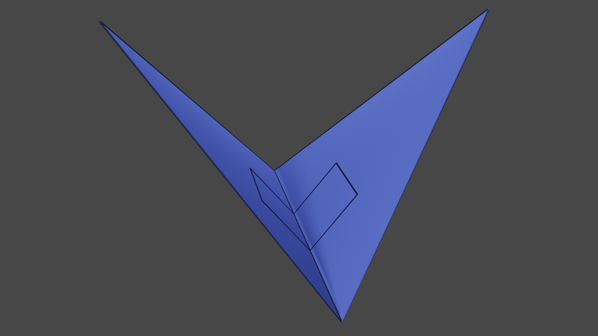

# Hello MCUT world

In this tutorial, we will look at simple HelloWorld-style example of an MCUT application. The purpose of the tutorial is to get you up to speed with using MCUT for cutting arbitrary meshes.

## Input meshes

The first thing we will do is define our meshes, which are the source mesh and cut mesh. This section, describes how we define these meshes. 

### The source mesh

Here we will now define the source mesh, which will be cube as shown in the image below.

<div>
   
  <p style="text-align:center;font-size:70%;">The source mesh: a cube. </p>
</div>

```cpp
float cubeVertices[] = {
    -5, -5, 5, // 0
    5, -5, 5, // 1
    5, 5, 5, //2
    -5, 5, 5, //3
    -5, -5, -5, //4
    5, -5, -5, //5
    5, 5, -5, //6
    -5, 5, -5 //7
};
uint32_t cubeFaces[] = {
    0, 1, 2, 3, //0
    7, 6, 5, 4, //1
    1, 5, 6, 2, //2
    0, 3, 7, 4, //3
    3, 2, 6, 7, //4
    4, 5, 1, 0 //5
};
uint32_t cubeFaceSizes[] = {
    4, 4, 4, 4, 4, 4
};
uint32_t numCubeVertices = 8;
uint32_t numCubeFaces = 6;
```

As you see, we just use simple C-style arrays to define the geometry and connectivity of our cube. This is all that MCUT needs to define a mesh: 

* a list of vertices 
* a list faces (indices)
* a list of face sizes (a value for each face)  
* the number of vertices
* the number of faces

### The cut mesh

Now that we have defined our source mesh, lets define the cut mesh. This will be the object that we will be slicing our cube with. Here is what the cut mesh looks like, and the code for defining this mesh is provided just below too.

<div>
   
  <p style="text-align:center;font-size:70%;">The cut mesh: a quad bent in the middle. </p>
</div>

```cpp
float cutMeshVertices[] = {
    -20, -4, 0, //0
    0, 20, 20, //1
    20, -4, 0, //2
    0, 20, -20 //3
};
uint32_t cutMeshFaces[] = {
    0, 1, 2, //0
    0, 2, 3 //1
};
uint32_t cutMeshFaceSizes[] = {
    3, 3
};
uint32_t numCutMeshVertices = 4;
uint32_t numCutMeshFaces = 2;
```

Again, the data structures for defining our cut mesh are exactly the same as the source mesh. All we did was just change the data - simple.

### Visualising mesh placement

Before we proceed onto actually calling any MCUT functions, here is a visual depiction of the relative placement of the two meshes:

<div>
   
  <p style="text-align:center;font-size:70%;">A combined visualisation of our meshes, using their unmodified vertex coordinates.</p>
</div>

This relative positioning is determined by our vertex coordinates - as specified when we defined the meshes.

## Using the MCUT API

Up to now, we have described how to define meshes in a suitable format for MCUT to read. This is the first step of using MCUT - actually defining the mesh data to use for cutting. In this section, we will now describe how to cut our cube mesh with the cut mesh using MCUT.

### Creating a context

First things first, we must create a context. MCUT contexts are represented by `McContext` data structures, and you can create
them using:

```cpp
McContext context = MC_NULL_HANDLE;
mcCreateContext(&context, MC_NULL_HANDLE);
```

MCUT uses the allocated context object to handle state, memory resources, etc. We can also think of `mcCreateContext` like the 'init' function (kinda...). 

And thats pretty much it - thats all we need to do in order to "initialize" MCUT before we can do _the fun stuff_. 

Lets do some cutting.

### The dispatch call

Now that we have our mesh data and a context has been created, the next step is cut the cube. To do this, we call the `mcDispatch` function like this:

```cpp
mcDispatch(
    context,
    MC_DISPATCH_VERTEX_ARRAY_FLOAT,
    cubeVertices,
    cubeFaces,
    cubeFaceSizes,
    numCubeVertices,
    numCubeFaces,
    cutMeshVertices,
    cutMeshFaces,
    cutMeshFaceSizes,
    numCutMeshVertices,
    numCutMeshFaces,
    0, NULL, NULL);
```

... and that's it - we have cut our cube. Simple huh..? 

Before moving on to the next section, let peek at the parameters a bit. They seem a lot at-first-glance but if we look closer we can see that most of them are just our mesh variables that we defined previously. So they are covered. The first parameter is our context (of-course!) which will hold all information/state relating to our operation. The second parameter specifies how MCUT should interpret our vertex arrays (`cubeVertices` and `cutMeshVertices`). In this example, `MC_DISPATCH_VERTEX_ARRAY_FLOAT` means "interpret the data as 32-bit floats" which must match with our arrays. We can ignore the last three because we dont need them here (thread synchronisation stuff).

### Where's my output?

At this point, MCUT has cut the cube, which was done by calling using the `mcDispatch` function. However, there's no evidence of output meshes anywhere in our code which we need to show that MCUT actually did something! So in this section, we will find out how to ask MCUT to give us the result(s) of the cutting operation that we just performed. 

#### How many meshes?

The first step to getting our output from MCUT to query for how many meshes (otherwise known as "connected components") of a particular type are available. Since we are learning about what MCUT can do, we will request _all_ of the output that resulted from our cube being cut. Here's how we do that:

```cpp
uint32_t numConnComps;
std::vector<McConnectedComponent> connComps;
mcGetConnectedComponents(context, MC_TRUE, MC_CONNECTED_COMPONENT_TYPE_ALL, 0, NULL, &numConnComps, 0, NULL, NULL);
connComps.resize(numConnComps);
mcGetConnectedComponents(context, MC_TRUE, MC_CONNECTED_COMPONENT_TYPE_ALL, (uint32_t)connComps.size(), connComps.data(), NULL, 0, NULL, NULL);
```

Notice how we had to call `mcGetConnectedComponents` twice? We do this because in MCUT querying information is a two-step process. First you need to allocate memory for one or more structures. Then you need to initialize these structures. 

The code above calls `mcGetConnectedComponents` twice. The first time, it places the number of connected components in the `numConnComps` variable. The second time, it places `McConnectedComponent` structures in the `connComps` array. We’ll employ this _function-allocation-function_ procedure for many other types of queries as well.

Notice that we also provided the parameter `MC_CONNECTED_COMPONENT_TYPE_ALL` which specifies that we want all connected components from MCUT. This allows for filtering to get just the connected components we want by specifying different values.


#### Accessing mesh data

Once we've accessed an available connected component, we can access every type of data that we can query for one - like its vertices. 

In code, connected components (i.e. meshes) are represented by `McConnectedComponent` structures. These are easy to
work with, and the functions that relate to connected component data are very similar to `mcGetConnectedComponents` from the preceding section. This section presents the another MCUT connected component function,
`mcGetConnectedComponentData`, and shows how it is used in code.

As its name implies, `mcGetConnectedComponentData` accepts a `McConnectedComponent` (amongst others) and provides information about the corresponding connected component. This operates in exactly the same way that `mcGetConnectedComponents` does: Identify the type
of information you’re looking for, and the function will place the data in the memory referenced.

We will now show how to query connected componented data. Assume that these variables have been defined in the following snippets:

```cpp
McConnectedComponent connComp = connComps[i]; // connected component handle.
uint64_t numBytes = 0; // number of bytes we must allocate.
```

And here is how we query the data of a connected component (vertices, faces etc.):

*query the number of vertices*

```cpp
mcGetConnectedComponentData(context, MC_TRUE, connComp, MC_CONNECTED_COMPONENT_DATA_VERTEX_COUNT, 0, NULL, &numBytes, 0, NULL, NULL);
uint32_t numberOfVertices = 0;
mcGetConnectedComponentData(context, MC_TRUE, connComp, MC_CONNECTED_COMPONENT_DATA_VERTEX_COUNT, numBytes, &numberOfVertices, NULL, 0, NULL, NULL);
```

*query the vertices*

```cpp
mcGetConnectedComponentData(context, MC_TRUE, connComp, MC_CONNECTED_COMPONENT_DATA_VERTEX_FLOAT, 0, NULL, &numBytes, 0, NULL, NULL);
std::vector<float> vertices;
vertices.resize(numBytes / sizeof(float)); //... or --> numberOfVertices * 3
mcGetConnectedComponentData(context, MC_TRUE, connComp, MC_CONNECTED_COMPONENT_DATA_VERTEX_FLOAT, numBytes, (void*)vertices.data(), NULL, 0, NULL, NULL);
```

*query the faces*

```cpp
mcGetConnectedComponentData(context, MC_TRUE, connComp, MC_CONNECTED_COMPONENT_DATA_FACE, 0, NULL, &numBytes, 0, NULL, NULL);
std::vector<uint32_t> faceIndices;
faceIndices.resize(numBytes / sizeof(uint32_t));
mcGetConnectedComponentData(context, MC_TRUE, connComp, MC_CONNECTED_COMPONENT_DATA_FACE, numBytes, faceIndices.data(), NULL, 0, NULL, NULL);
```

*query the face sizes*

```cpp
mcGetConnectedComponentData(context, MC_TRUE, connComp, MC_CONNECTED_COMPONENT_DATA_FACE_SIZE, 0, NULL, &numBytes, 0, NULL, NULL);
std::vector<uint32_t> faceSizes;
faceSizes.resize(numBytes / sizeof(uint32_t));
mcGetConnectedComponentData(context, MC_TRUE, connComp, MC_CONNECTED_COMPONENT_DATA_FACE_SIZE, numBytes, faceSizes.data(), NULL, 0, NULL, NULL);
```

Glancing through the code, its fairly easy to see that we are using `mcGetConnectedComponentData` similarly to the way we used `mcGetConnectedComponents` in the previous section, which makes the library very easy to use.

We are done! So lets clean up before seeing our results and wrapping up below.

### Cleaning up

Now that we have finished using MCUT, we must free all resources that were allocated for our connected components. Since we want to free all connected component data, we will just do:

```cpp
mcReleaseConnectedComponents(context, 0, NULL);
```

... which will release the resources held by the library for _all_ connected components.

Finally, we will also destroy our context since we will not be performing any further cutting operations. Here's how we do that:

```cpp
mcReleaseContext(context);
```

### Results

In this section, we show the meshes produced as a result of cutting our cube with MCUT.

*Internally sealed fragments*

Here we show the canonical results of the cut, which are the two watertight fragments of our cube. We have effectively cut and filled the holes in our cube to produce the fragments.

<div class="container">
    <div style="float:left;width:49%">
	   
       <p style="text-align:center;font-size:80%;">Internally-sealed lower fragment.</p>
    </div>
    <div style="float:right;width:49%">
	    
        <p style="text-align:center;font-size:80%;">Internally-sealed upper fragment.</p>
    </div>
</div>

*Externally sealed fragments*

Here we show an odd but unique case, which is an example of sealing our cube from the outside. 

<div class="container">
    <div style="float:left;width:49%">
	   
       <p style="text-align:center;font-size:80%;">Externally-sealed lower fragment.</p>
    </div>
    <div style="float:right;width:49%">
	    
        <p style="text-align:center;font-size:80%;">Externally-sealed upper fragment.</p>
    </div>
</div>

Such a result is readily produced by MCUT, and is the cornerstone of MCUT's support of CSG (boolean) operations. As you may imagine, this feature enables new techniques and effects for mesh editing tools.

*Unsealed fragments*

In this example, we show that not only can MCUT produce watertight and externally sealed meshes, but that MCUT can also provide the unsealed fragments of the source mesh. It is also possible to retrieve partially sealed meshes which is not shown here.

<div class="container">
    <div style="float:left;width:49%">
	   
       <p style="text-align:center;font-size:80%;">Unsealed lower fragment.</p>
    </div>
    <div style="float:right;width:49%">
	    
        <p style="text-align:center;font-size:80%;">Unsealed upper fragment.</p>
    </div>
</div>

*Patches*

While the focus is generally on the source much, the versatility MCUT also allows us to create cut-outs of the cut mesh.

<div class="container">
    <div style="float:left;width:49%">
	   
       <p style="text-align:center;font-size:80%;">Interior patch.</p>
    </div>
    <div style="float:right;width:49%">
	    
        <p style="text-align:center;font-size:80%;">Exterior patch.</p>
    </div>
</div>

We refer to this as _stencilling_. The left image show the interior patch of the cut surface, which can be used for emulating effects like "gingerbread man" style cut-outs. On the right, we show the exterior patch which likewise holds potential use-cases of its own. One example application, is producing silhouette cut-outs for simulating deformation or cloth-like effects on intricate geometries. 

*Seams*

Finally, in this example we show that MCUT can also be used as a practical tool for computing intersection contours. These are the paths of intersection between the source mesh and cut mesh.

<div class="container">
    <div style="float:left;width:49%">
	   
       <p style="text-align:center;font-size:80%;">Source mesh with added seam.</p>
    </div>
    <div style="float:right;width:49%">
	    
        <p style="text-align:center;font-size:80%;">Cut mesh with added seam.</p>
    </div>
</div>

One example application of seams is global intersection analysis in character animation, which is the backbone of industry-standard collision-response algorithms for unoriented objects like cloth. A key point to note here is that this feature results directly from the generality of MCUT, resolving mesh intersections using the half-edge data structure. 

### Summary

In this tutorial, we have looked a simple HelloWorld-style of application using MCUT. First, mesh initialisation was described, showing that defining a mesh boils doing to simple C-style arrays. We then proceeded to create an MCUT context, which allowed us to submit a dispatch call to do the cutting. We demonstrated that all of these steps were brief and simple. Next, we delved into the task of querying data from MCUT after a dispatch call. In this regard, we found out how MCUT uses a "function-allocation-function procedure" to query information. This was then used to access connected components (our meshes), and their data (vertices, face indices etc.). Finally, we finished off by showing how to free internal memory allocated by the MCUT library, and then topped off with some nice visualisations of the output meshes.